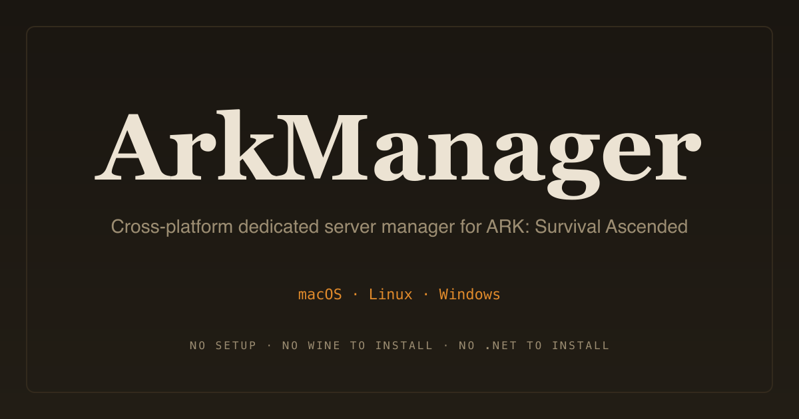
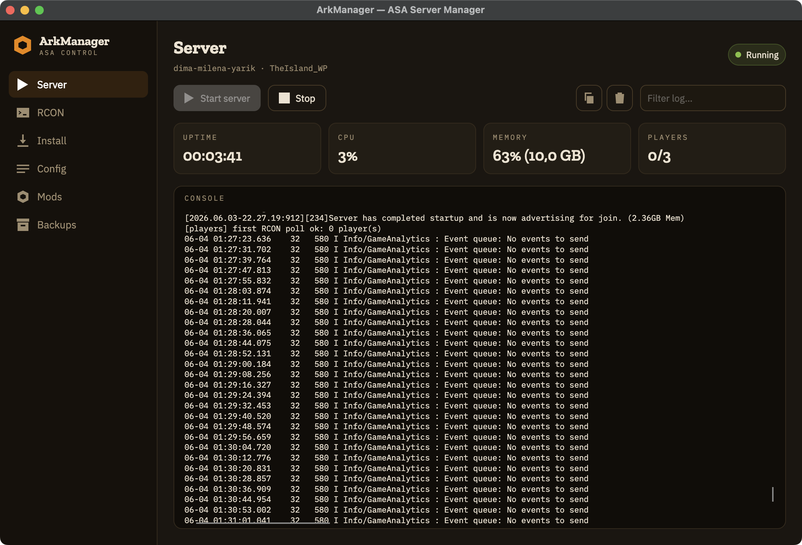
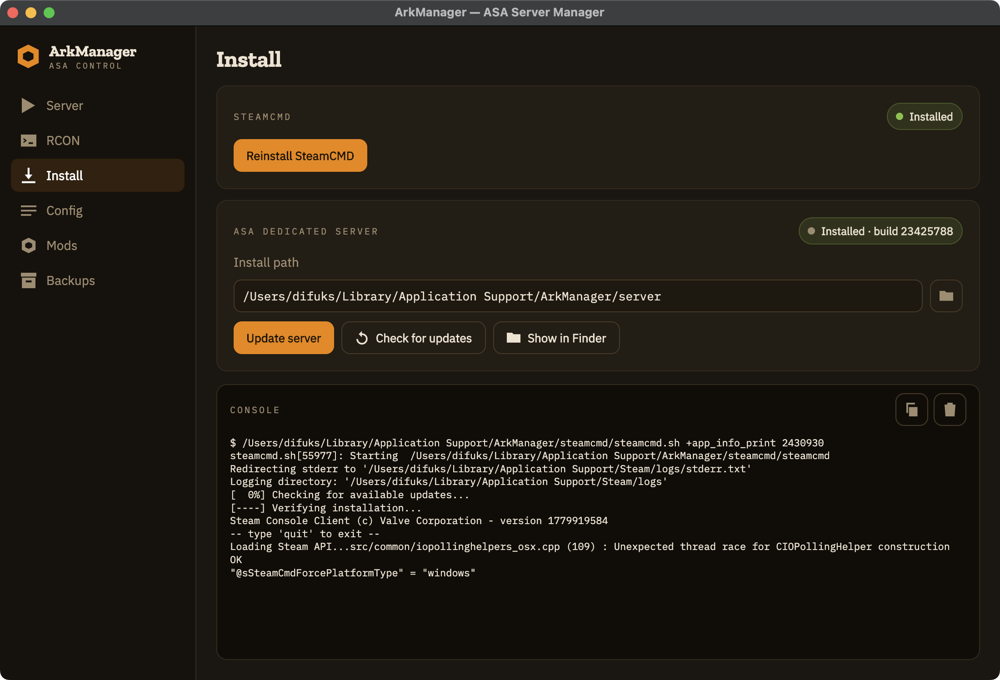
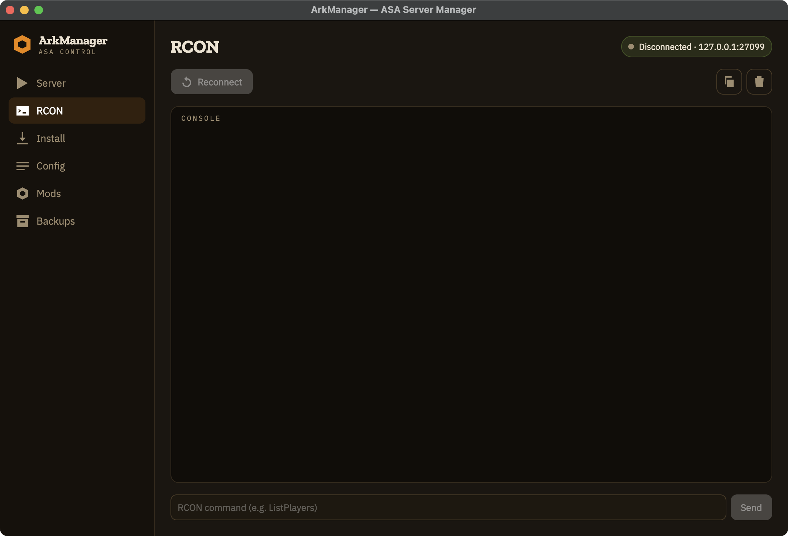
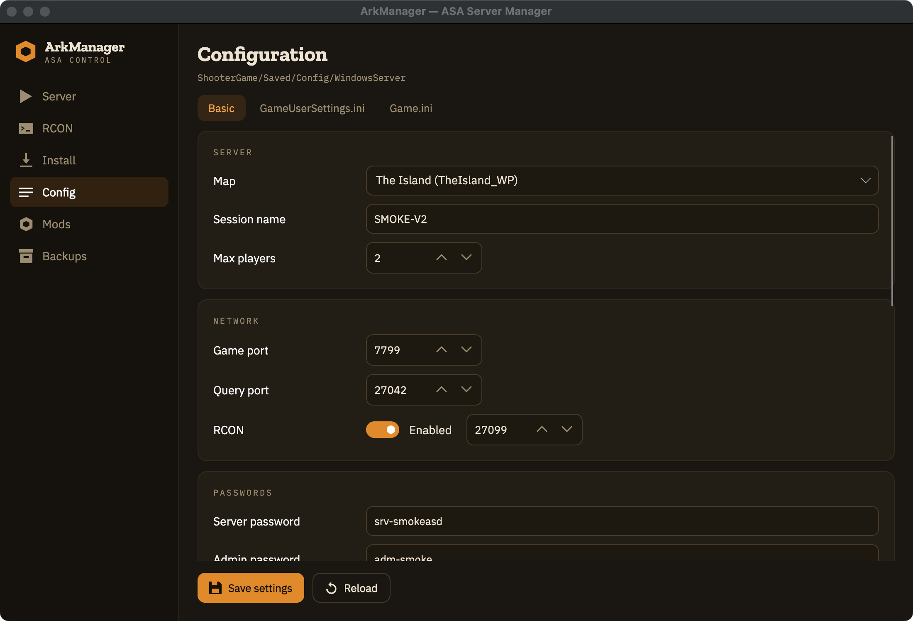
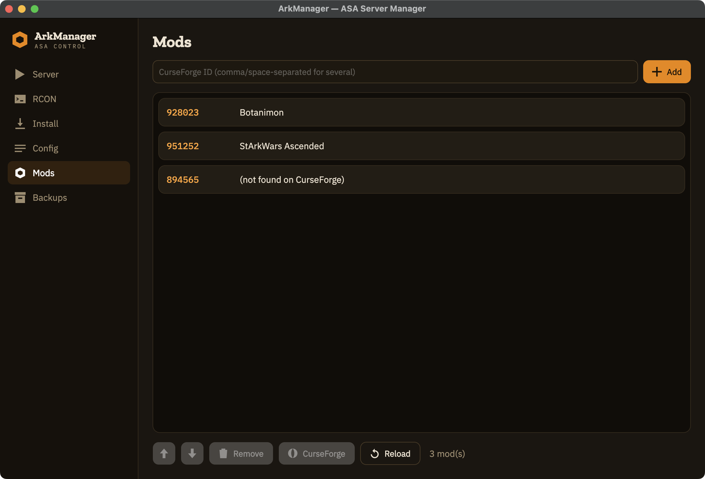
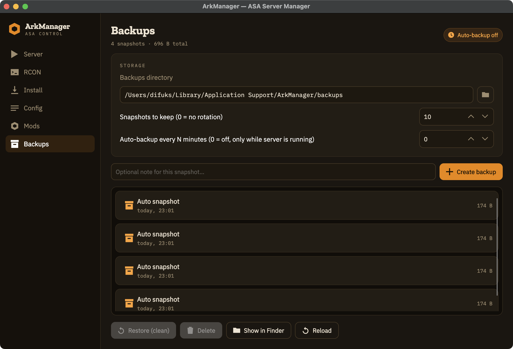

<div align="center">



<br>

[](https://github.com/DiFuks/ark-manager/releases/latest)
[](https://github.com/DiFuks/ark-manager/releases)
[](https://github.com/DiFuks/ark-manager/actions/workflows/release.yml)
[](https://dotnet.microsoft.com/)
[](LICENSE)
[](#download)
[](https://arkmanager.org)

**A dedicated server manager for ARK: Survival Ascended.**
No setup. No wine to install. No .NET runtime to install.

[**⬇ Download**](https://github.com/DiFuks/ark-manager/releases/latest) · [**Website**](https://arkmanager.org) · [Quick start](#quick-start) · [Build from source](#build-from-source)

<br>



</div>

---

## Download

Grab the archive for your OS from the [latest release](https://github.com/DiFuks/ark-manager/releases/latest),
unpack and run. **The .NET runtime and wine are embedded** — nothing else to install.

| Platform | Architecture | Archive |
| --- | --- | --- |
| macOS    | Apple Silicon (arm64) | `.zip` |
| Linux    | x64 | `.tar.gz` |
| Windows  | x64 | `.zip` |

First launch on macOS / Windows is gated by the OS because the app is not paid-signed:

- **macOS** — right-click → **Open** once (ad-hoc signed, not notarized).
- **Windows** — SmartScreen → **More info** → **Run anyway** (no Authenticode cert).

> The ASA dedicated server itself is a Windows `.exe` — there is no native mac/linux build.
> On macOS / Linux ArkManager runs it through **bundled wine** (gcenx wine-stable / lutris-wine,
> SHA256-verified, no Homebrew / apt needed); on Windows it runs natively.

## Features

- **Install / update** the server via SteamCMD (app id `2430930`) — one click, progress streamed.
- **Start / stop** with live log, uptime / PID, auto-restart on crash, and a graceful
  RCON `saveworld` → `DoExit` shutdown before kill.
- **RCON client** (Source RCON / TCP) — one-click `saveworld` / `DoExit` / `Broadcast`,
  plus a live player counter on the Server tab.
- **Config editor** for `GameUserSettings.ini` / `Game.ini` — form view *and* raw tabs,
  auto-reloaded from disk when you switch tabs.
- **Backups** of `ShooterGame/Saved/` — zip, rotation, and background auto-backups on an interval.
- **Mods** via CurseForge — paste IDs, names are resolved automatically (no API key needed).
- **Cluster** support — `-ClusterId` / `-ClusterDirOverride` with a folder picker.
- **7 map presets** — TheIsland, TheCenter, ScorchedEarth, Aberration, Extinction, Astraeos, Ragnarok.

<details>
<summary><b>Screenshots</b> — Install · RCON · Config · Mods · Backups</summary>

<br>

| | |
| --- | --- |
|  |  |
|  |  |
|  | |

</details>

## Quick start

1. **Install** → `Install SteamCMD` → `Install server`. The first run is slow (~25 GB).
   Until the server is installed, only the Install tab is shown; afterwards the full
   navigation unlocks.
2. **Config** → set `Session name`, `Admin password`, ports. Defaults are sensible, so you
   can start right away. RCON is on by default (port 27020).
3. **Mods** → paste CurseForge IDs (comma-separated) → `Add`. Names resolve when the tab opens.
4. **Server** → `▶ Start`. The very first launch spends ~30s letting wine build its prefix,
   then ASA loads the world.
5. **Backups** → `Create`, or enable auto-backup every N minutes (only ticks while `Running`).

## Build from source

Requires the **.NET 10 SDK**. The solution is `ArkManager.slnx` (the .NET 10 XML format).

```bash
git clone https://github.com/DiFuks/ark-manager.git
cd ark-manager

# dev iteration
dotnet build ArkManager.slnx
dotnet test  ArkManager.slnx
dotnet run --project src/ArkManager.Desktop/ArkManager.App.csproj

# production bundles for all 3 platforms (from a single mac/linux host)
./build.sh                     # mac + linux + win
./build.sh --target macos      # single target
make mac / make linux / make windows
make run                       # open the built .app from dist/
make clean
```

Running via `dotnet run` (no bundle): `BundledWineLauncher` looks for wine in
`ARKMANAGER_WINE_PATH`, then inside the bundle, then in the build cache
`~/.cache/ark-manager/wine/<sha>/.../bin/`. So once you've run `./build.sh` once,
wine is on disk and `dotnet run` finds it automatically — no env var needed.

Architecture, invariants and gotchas live in [`CLAUDE.md`](CLAUDE.md).

## Tests

```bash
dotnet test ArkManager.slnx
```

xUnit, no mocking frameworks — pure-logic units only. Cover: `IniFile` round-trip,
`ServerCommandLine.Build` (passwords / RCON deliberately kept out of the URL),
SteamCMD parsers (`appmanifest_*.acf` + `app_info_print`), the bootstrap URL helper,
and `PlayerPoller`.

## Tech stack

.NET 10 · [Avalonia 12](https://avaloniaui.net/) · CommunityToolkit.Mvvm · self-contained
publish with embedded wine on macOS/Linux.

<details>
<summary><b>Intentionally out of scope</b></summary>

<br>

- Multi-instance UI (the `Profiles` model exists, the GUI drives only the first one).
- CurseForge browser / search (only ID → name resolution).
- GUI i18n — the UI is English only.
- AppImage / `.dmg` / native installers — only `.zip` / `.tar.gz`.
- Code signing / notarization — ad-hoc on macOS only.
- Headless CLI — GUI only.
- ARM64 Linux, Intel Mac — untested.

</details>

## License

ArkManager is released under the [MIT License](LICENSE).

Bundled wine sources are redistributable: WineHQ (LGPL 2.1), gcenx macOS builds,
lutris-wine Linux builds — pinned versions + SHA256 in
[`build/wine-sources.json`](build/wine-sources.json).
